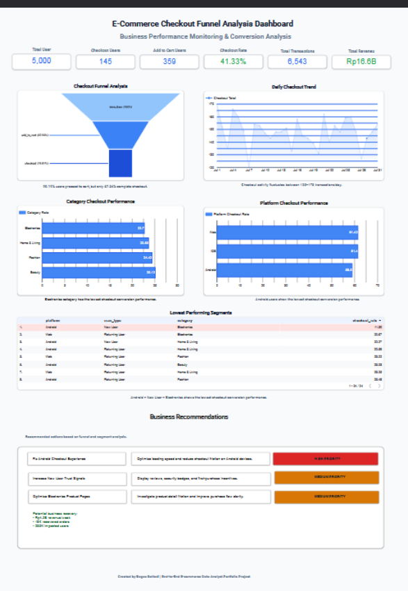

# 🛒 E-Commerce Checkout Funnel Analysis Dashboard

End-to-end Data Analyst portfolio project using BigQuery and Looker Studio.

## 📌 Project Background

This project analyzes checkout funnel performance in an e-commerce platform to identify conversion drop issues and business impact.

## 🎯 Objectives

- Analyze checkout funnel conversion
- Identify low-performing user segments
- Monitor checkout trends
- Generate actionable business recommendations

---

## 🛠️ Tools Used

- Google BigQuery
- Looker Studio
- SQL
- CSV Dataset

---

## 📊 Dashboard Features

### KPI Monitoring

- Total Users
- Add to Cart Users
- Checkout Users
- Checkout Rate
- Total Revenue
- Total Transactions

### Analysis

- Funnel Analysis
- Daily Checkout Trend
- Platform Analysis
- Category Analysis
- Lowest Performing Segment

---

## 💡 Key Insights

- Android users show the lowest checkout conversion rate
- Electronics category has the weakest checkout performance
- New users experience the highest drop-off during checkout

---

## 🚀 Business Recommendations

1. Optimize Android checkout experience
2. Improve trust signals for new users
3. Optimize electronics product pages

---

## 📷 Dashboard Preview

---

## 📂 Dataset

Dummy realistic e-commerce dataset containing:

- users
- events
- transactions

---

## 👨‍💻 Author

Bagas Setiadi
# ecommerce-checkout-funnel-analysis
# ecommerce-checkout-funnel-analysis
# ecommerce-checkout-funnel-analysisx
